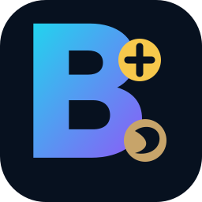

<p align="center">
  
</p>

<h1 align="center">MergeForge</h1>

<p align="center">
  <strong>Private LTC + DOGE merged solo mining for Umbrel</strong><br>
  Developed by Mikal
</p>


### Private LTC + DOGE merged solo mining for Umbrel

**MergeForge** is a self-hosted Scrypt merged-mining application for Umbrel, designed for home miners such as the **Lucky Miner LG07**.

Mine **Litecoin (LTC)** as the parent chain while simultaneously participating in **Dogecoin (DOGE) AuxPoW merged mining** through one local Stratum connection.

> **Developed by Mikal**

---

## MergeForge 0.1.1 Developer Preview

MergeForge is currently in private development and physical hardware validation.

The initial developer release is designed to:

- install as an Umbrel Community App
- provide a modern MergeForge dashboard
- run a local LTC + DOGE merged-mining backend
- accept Scrypt ASIC connections over Stratum V1
- support Lucky Miner LG07 testing
- persist backend state across Umbrel restarts
- keep mining infrastructure private and self-hosted
- require only public receiving addresses
- never request wallet private keys or seed phrases

> **Developer Preview:** accepted Stratum shares are not proof that an LTC or DOGE block has been found. Full reward and merged-block behavior must be verified through physical testing before production release.

---

## Mining Architecture

The initial MergeForge developer preview uses a lightweight **c2pool-based** LTC + DOGE merged-mining backend.

Current design:

- Scrypt mining
- Stratum V1
- Litecoin parent-chain work
- Dogecoin AuxPoW merged mining
- VARDIFF
- persistent backend state
- one local miner connection
- no custodial payout wallet

MergeForge uses dedicated pruned Litecoin Core and Dogecoin Core containers as the authoritative parent and AuxPoW chain nodes. c2pool provides Stratum V1, VARDIFF, solo-mining coordination, and LTC+DOGE merged mining while the Core RPC interfaces remain isolated on the internal backend network.

---

## Lucky Miner LG07

Initial miner configuration:

```text
Pool
stratum+tcp://YOUR-UMBREL-IP:3333

Username
YOUR_LITECOIN_RECEIVING_ADDRESS

Password
x
```

Example pool URL:

```text
stratum+tcp://192.168.8.109:3333
```

The exact payout and worker semantics of the selected backend will be confirmed during physical LG07 acceptance testing before production release.

---

## Features

| Feature | Status |
|---|---|
| Umbrel Community App | Included |
| Modern MergeForge dashboard | Included |
| Scrypt Stratum V1 | Included |
| Lucky Miner LG07 support | Testing |
| Litecoin parent mining | Included |
| Dogecoin AuxPoW merged mining | Testing |
| Variable difficulty | Included |
| Persistent backend state | Included |
| Umbrel-authenticated dashboard | Included |
| Public receiving address only | Included |
| Private keys required | Never |
| Seed phrases required | Never |
| Docker socket access | No |
| Privileged containers | No |
| Production release | Not yet |

---

## Security

MergeForge is designed to remain non-custodial.

The application must never request or store:

- private keys
- seed phrases
- mnemonic phrases
- wallet recovery phrases

Mining configuration uses public receiving addresses only.

The application also avoids:

- privileged containers
- host networking
- Docker socket access
- public database ports
- unnecessary administrative interfaces
- hard-coded production secrets

Persistent mining data is designed to survive normal Umbrel restarts and updates.

---

## Project Structure

```text
mergeforge-ltc-doge/
├── c2pool/
├── docs/
├── scripts/
├── web/
├── docker-compose.yml
├── exports.sh
├── umbrel-app.yml
├── CHANGELOG.md
├── SECURITY.md
└── VERSIONS.md
```

The repository root also contains the Umbrel Community App Store manifest.

---

## Development Workflow

MergeForge follows the same release discipline used for DigiForge:

1. develop privately
2. validate configuration and source
3. build local images
4. test installation on Umbrel
5. physically test the Lucky Miner LG07
6. measure accepted, rejected, stale and duplicate shares
7. verify real LTC + DOGE merged-mining behavior
8. perform managed Umbrel restart testing
9. audit exposed ports
10. build final release images
11. pin immutable container digests
12. update documentation and screenshots
13. publish only after release validation

The managed Umbrel app-store checkout is not used as the primary development directory.

---

## Support MergeForge

<div align="center">

### Support Continued Development

MergeForge is independently developed by **Mikal**.

If MergeForge is useful to you and you would like to support continued development, voluntary contributions can be sent using one of the public receiving addresses below.

</div>

| Network | Public Receiving Address | QR |
| --- | --- | :---: |
| **Bitcoin (BTC)** | `bc1qhaj04fx5rts85ypavgxwgvlg44jhgje7ymsq0u` |  |
| **Ethereum (ETH)** | `0x0E9f6aeb5537Dcca347c0c858989dd10CDBBB7b2` |  |
| **Dogecoin (DOGE)** | `D7zbwfjWY1KzWgtBtsiuhbdcoGutFH8pkd` |  |
| **Litecoin (LTC)** | `ltc1q67h4p7durruk8xkjz3yh6v3jrua5jxh9yy3s9q` |  |
| **DigiByte (DGB)** | `dgb1qy4h02rhasx2f8q7whn4sanfsdhgajhek34dsv5` |  |

> Support addresses are public receiving addresses only. Mining rewards are controlled by the mining configuration. Support is entirely optional and does not provide additional features, mining advantages, or privileges.

---

## Project Status

**Current version:** `0.1.1` (developer preview)

**Current milestone:** Lucky Miner LG07 physical mining validation

Planned next stages include:

- backend telemetry refinement
- authoritative accepted/rejected-share statistics
- merged-mining health monitoring
- block candidate history
- richer performance charts
- managed Umbrel restart testing
- immutable GHCR release images
- final Umbrel branding and screenshots

---

## Important Mining Notice

Solo mining is probabilistic.

An accepted Stratum share is not necessarily a Litecoin block or Dogecoin AuxPoW block.

MergeForge should only report a block as found or accepted when the authoritative mining backend or blockchain node confirms it.

---

## License

See [`mergeforge-ltc-doge/LICENSE`](mergeforge-ltc-doge/LICENSE).

---

<p align="center">
  <strong>MergeForge</strong><br>
  Litecoin · Dogecoin · Scrypt · AuxPoW · Solo Mining · Umbrel<br><br>
  Developed by Mikal
</p>
